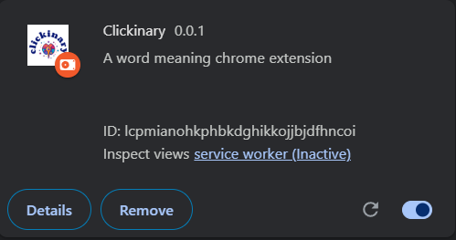

A word meaning chrome extension



# Clickinary
A word meaning Chrome extension

## Description
Clickinary is a Chrome extension built using JavaScript that allows users to get the meaning of any word on a webpage.  
- Simply select a word, right-click, and click **"Get Meaning"** from the context menu.  
- The original word will be replaced with its meaning in **purple text**.  
- The extension uses the **Free Dictionary API** to fetch meanings.  
- If the word is misspelled or the meaning is not found, the text will be replaced with: `!Meaning not found!`.

## How it Works / Flow
1. **Context Menu**: The background script listens for a right-click on a selected word.  
2. **Fetch Meaning**: When "Get Meaning" is clicked, the extension fetches the meaning from the Free Dictionary API.  
3. **Send Message**: The background script sends the meaning to the content script.  
4. **Display Meaning**: The content script replaces the original word with the fetched meaning in purple text on the webpage.  

## Installation / Usage

 **Pre-requisites:**  
- Node.js

**Steps to run locally:**

```bash
1. # Clone the repository
git clone https://github.com/shiksha-Nath02/Clickinary.git
cd Clickinary

2. # Install dependencies
npm install

3. # Create production build
npm run build


4. Go to your Chrome Extensions Page (chrome://extensions/) on your chrome browser and enable the "Developer mode"


5. Click "Load unpacked" and select the build folder created


6. Open any website and start using!

 ## This extension is made using:
1. JavaScript
2. [Free Dictionary API](https://dictionaryapi.dev/)


 
